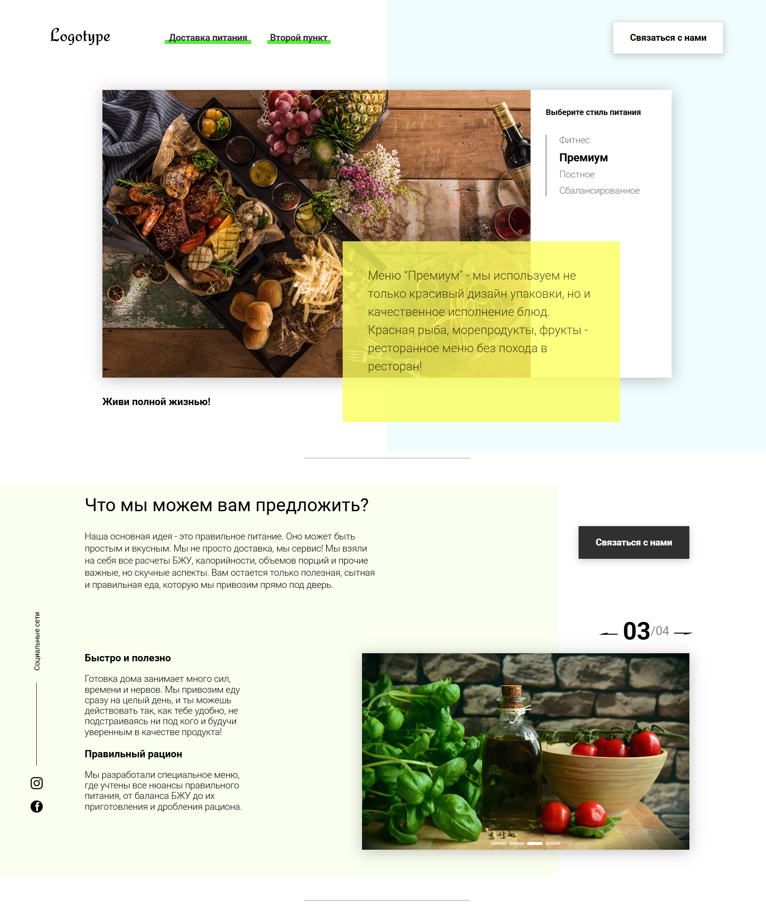

# 🍎 Landing page for a company providing special meals.

## Demonstration

  
  
  
  

## Features/highlights

- landing site example
- personal calorie calculator
- user-friendly interface to familiarize the user with the product

## Technologies

- Javascript (ES6 Modules)
- HTML, CSS
- Babel, Webpack
- JSON-server

## Setup

$ git clone https://github.com/AnastasiaDubinina022/food-app.git
$ cd food-app
$ npm i
$ npx json-server db.json
$ npx webpack

## Build

It is required to set the "production" mode in the settings webpack.config.js

$ npx webpack
